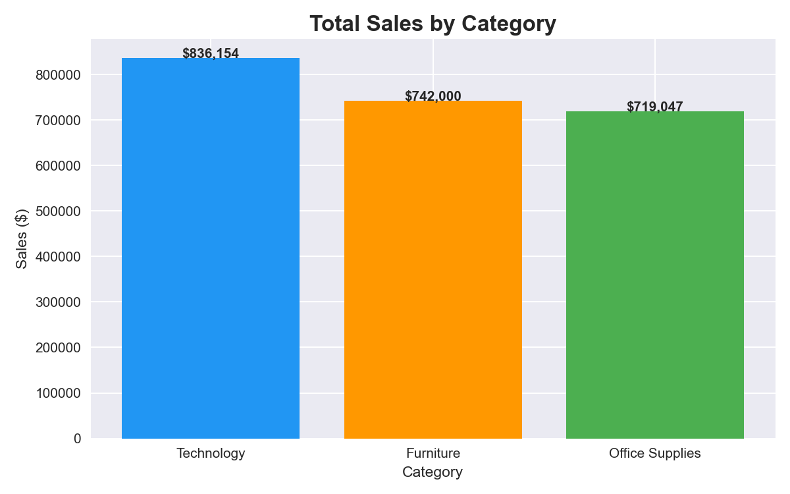
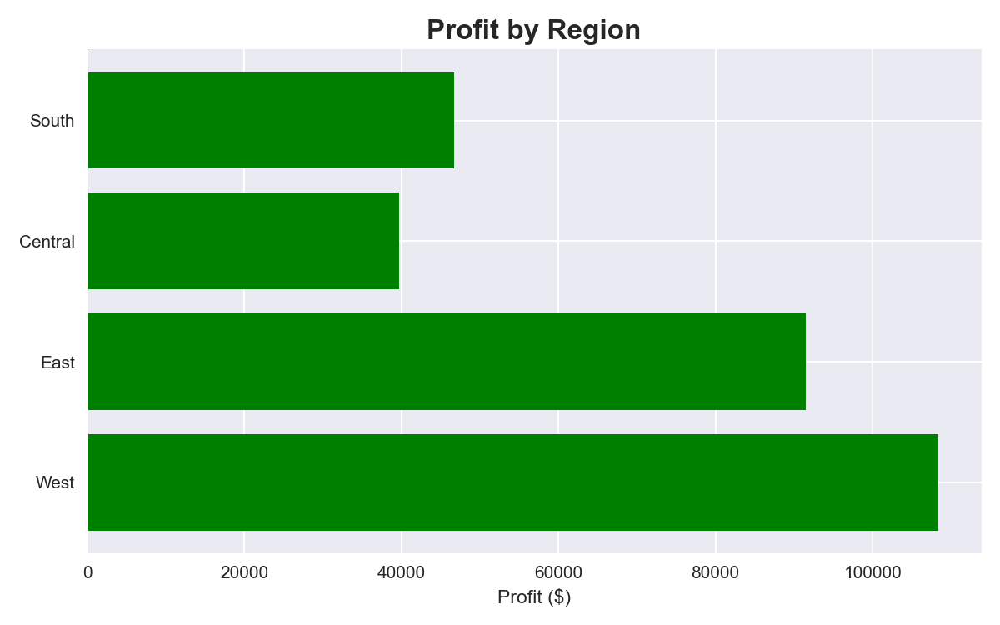
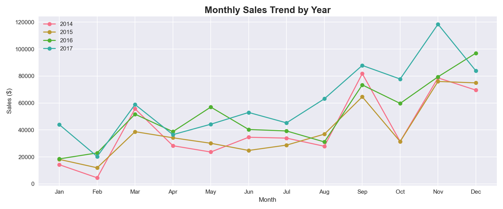
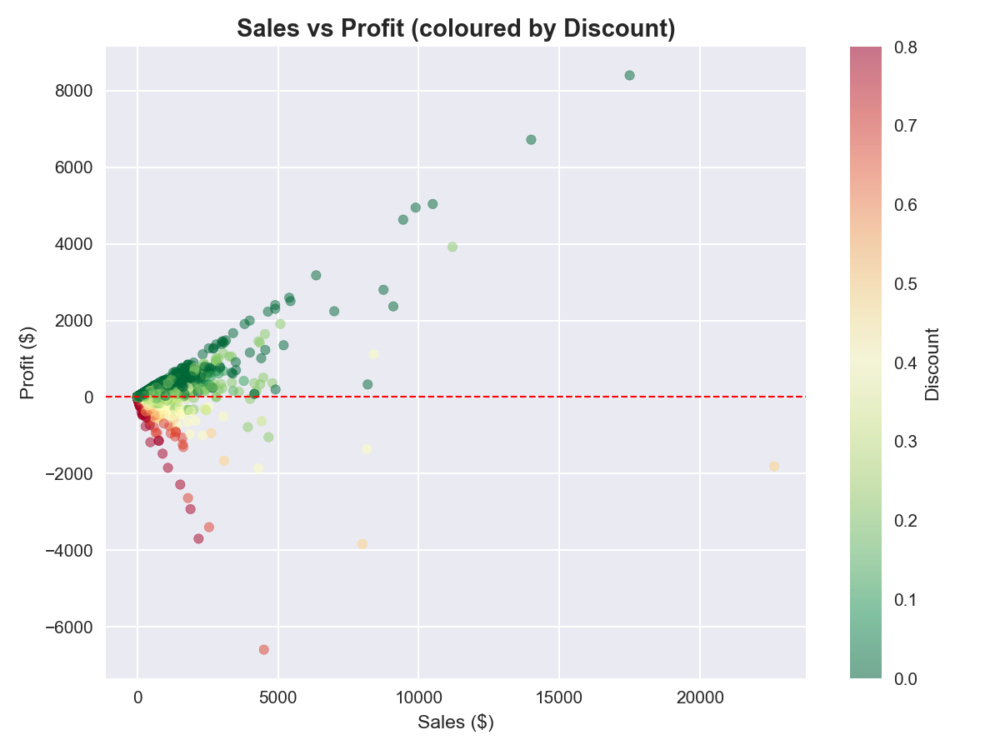

#  Sales Dashboard Analysis

An end-to-end exploratory data analysis of the Superstore retail dataset using Python and Plotly.

##  Overview
Analyzed **9,994 sales transactions** across 4 years (2014–2017) to uncover revenue trends, regional performance, and profit drivers.

##  Key Findings
- **Technology** is the top revenue category at $836,154 — but **Furniture** has the worst profit margin
- **Tables** sub-category sells ~$200k but operates at a **net loss** — a critical business problem
- **West region** is most profitable ($108k), **Central** is weakest ($39k)
- Sales **spike every November–December** across all 4 years (holiday effect)
- **Copiers** have the highest profit margin in the entire product catalog

##  Dashboard Preview

### Sales by Category

### Profit by Region

### Monthly Sales Trend

### Sub-Category Performance

##  Tools Used
- **Python** (pandas, numpy)
- **Plotly Express** — interactive charts
- **Jupyter Notebook**

##  Dataset
[Superstore Dataset — Kaggle](https://www.kaggle.com/datasets/vivek468/superstore-dataset-final)

##  How to Run
1. Clone the repo
2. Install dependencies: `pip install pandas plotly jupyter`
3. Open `Sales_Dashboard_Analysis.ipynb` in Jupyter
4. Run all cells (`Kernel → Restart & Run All`)

---
*Part of my Data Analytics Portfolio*